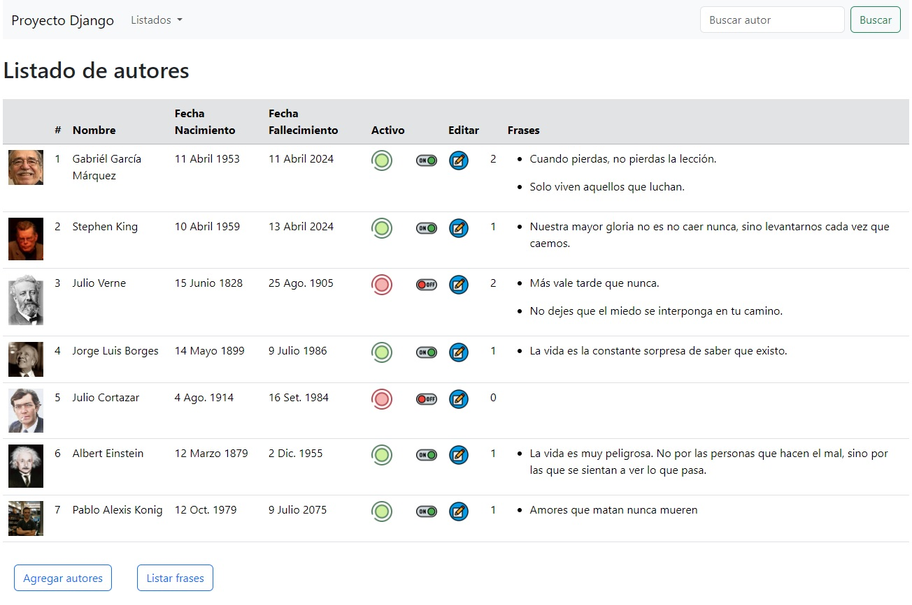
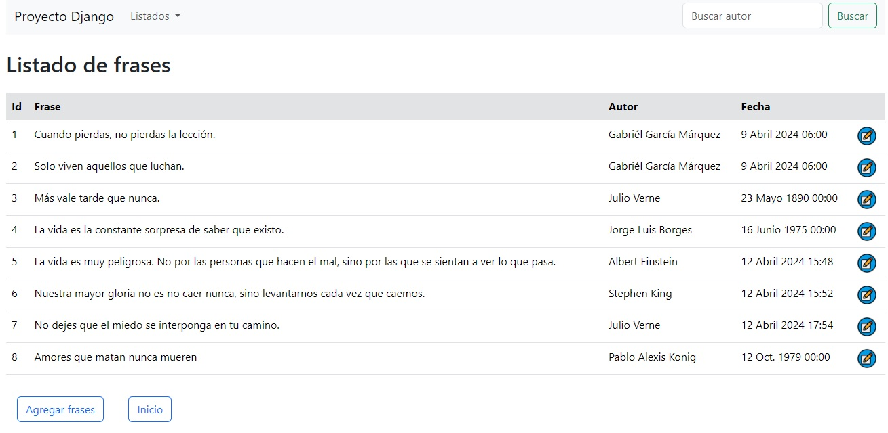

# Proyecto de práctica en Django y lenguaje python

Proyecto con app autores y app frases (Un modelo en cada app y relacionados con una foreignKey).

- Listado de autores con frases.
- Listado de frases con autores.
- Crear autor.
- Crear frases.
- Editar autor.
- Editar frase.
- Armado de los modelos Autores y Frases
- Creación de vistas con funciones y con clases.
- Plantillas con Bootstrap.
- Ruteo con los urls.py
- Envío de imágenes por formulario.
- Barra de búsqueda de autores funcional.
- Función de cambio de estado activación/desactivación de autores.
- Creación de requirements.txt

Se incluye la configuración de static y media. En media se suben las imagenes de los autores de forma automática desde el formulario de creación.

## Imagen del listado de autores con frases

## Imagen del listado de frases con autores

### Pablo Alexis König